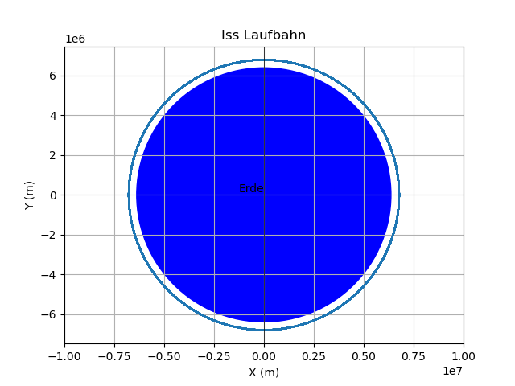
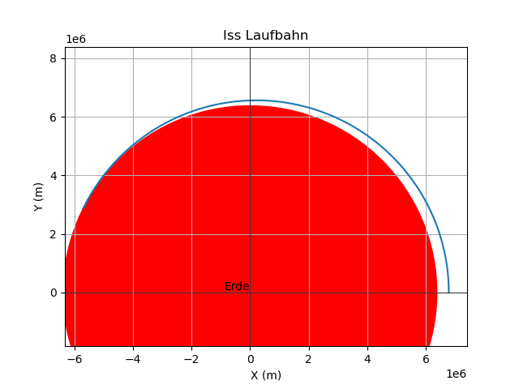
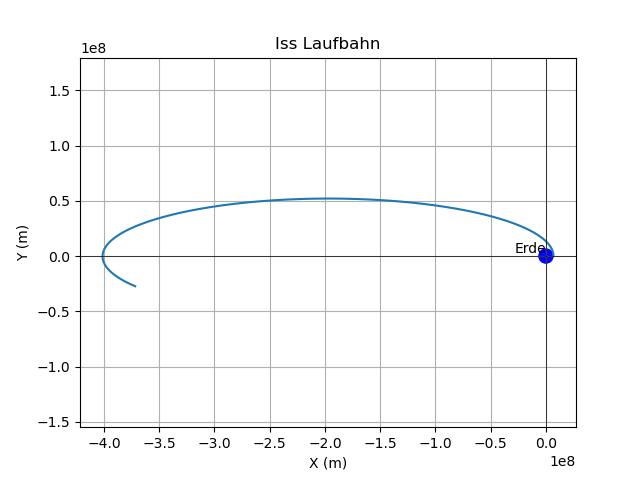

# two-body-problem
simulation of ISS in earth orbit 

## Usage:

 - clone this project
 - `pip install` the dependencies, i.e. `matplotlib` and `tqdm` 
 - Modify the parameters of the simulation as you like
 - Run the simulation via `python main.py` 
 - Enjoy the pretty picture
 - Close the Picture window to end to program (or hit Ctrl-C)

## Example Picutres

### 1. ISS in normal Orbit around the earth

### 2. ISS too slow

At about 98.4% of the nominal velocity ISS crashes on earths surface.

### 3. ISS too fast

at about 41% higher velocity ISS reach the distance of the moon.

        
        
        
